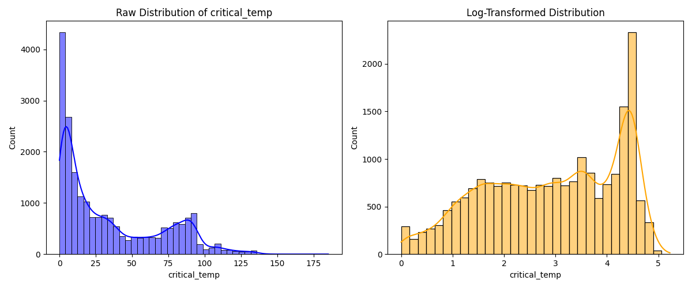
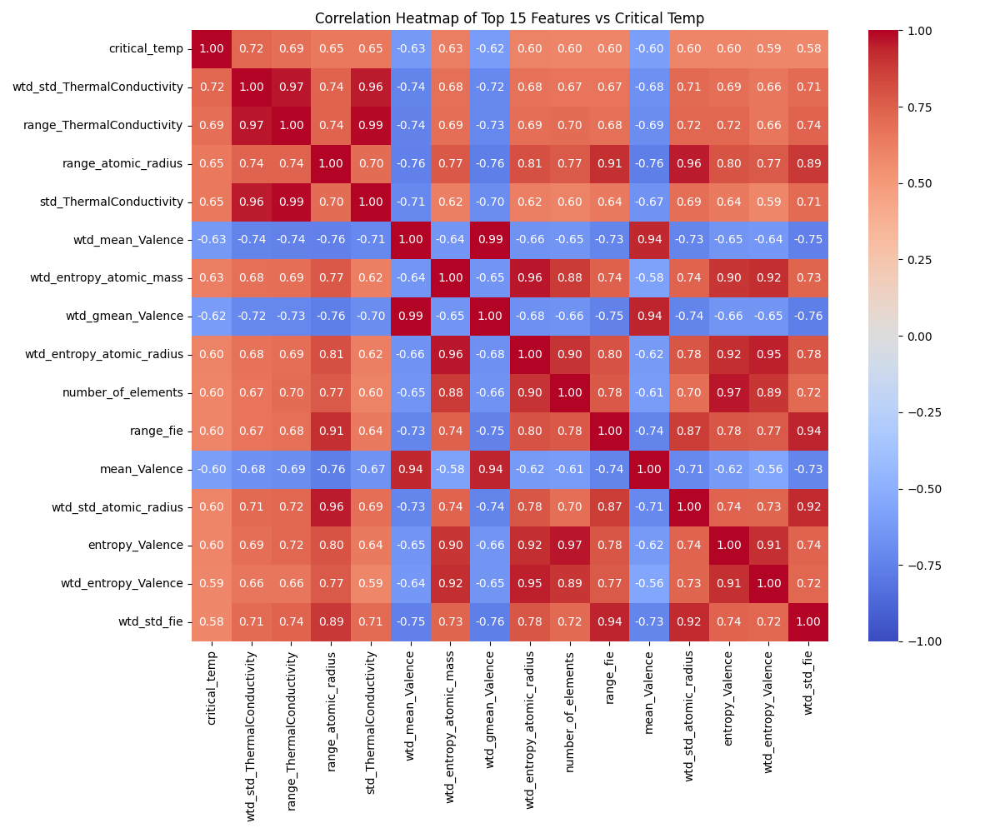
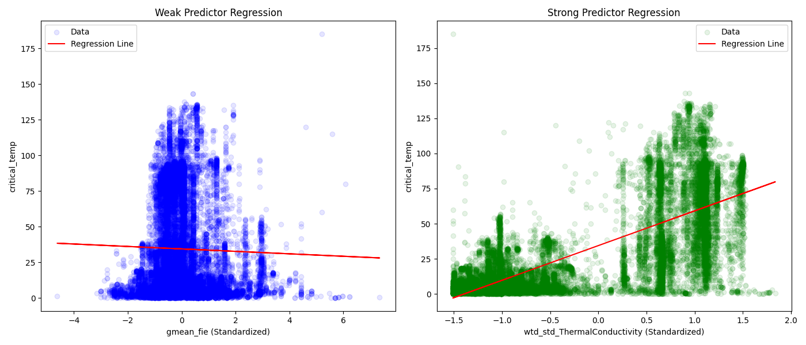
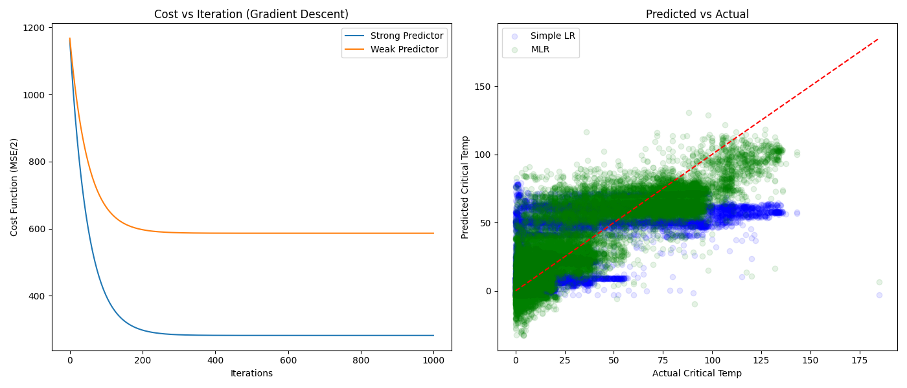

# Mandatory Assignment 1 - IDATG2208
**Course:** IDATG2208

## 1 Exercise-1 [60 Points]

### 1.1 Data Exploration [4 Points]

**Q1.1.1 Examine the summary statistics (mean, standard deviation, min, max, quartiles) of all 81 features and the target. Which features show the highest variation? Justify why comparing raw standard deviations across these features can be misleading, and propose a more suitable measure.**
Based on the summary statistics, the feature with the highest standard deviation is `range_Density` (std = 4097.13). However, comparing raw standard deviations across features is misleading because the features operate on vastly different numerical scales (e.g., density vs valence). A feature with large values will naturally tend to have a larger absolute standard deviation. 

A more suitable measure is the **Coefficient of Variation (CV)**, which normalizes the standard deviation by dividing it by the mean ($CV = \frac{\sigma}{\mu}$). Using this measure, the feature with the highest variation relative to its mean is `wtd_gmean_ThermalConductivity` (CV = 1.47).

**Q1.1.2 Plot the distribution of critical_temp before and after a log transform. Based on the shape of the distributions, discuss whether the raw or the transformed target should be used for regression later in this assignment.**

The raw distribution of `critical_temp` is heavily right-skewed, meaning most materials become superconducting at very low temperatures, with a long tail of higher critical temperatures. After applying a log transform, the distribution becomes much more uniform and closer to a normal distribution, though slightly bimodal.

For linear regression, normally distributed target variables and errors generally lead to more stable, reliable models with well-behaved residuals. However, interpreting a model predicting $\log(y)$ is slightly more complex than raw $y$. The instructions for the rest of the assignment do not mandate a log transform (and specifically mention predicting `critical_temp` directly in later tasks), so we will stick to the **raw target**, but the log-transformed target would generally be better suited for reducing heteroscedasticity.

### 1.2 Correlation Analysis [12 Points]

**Q1.2.1 Compute the correlation matrix of all features. Since a full 81 × 81 heatmap is unreadable, plot a heatmap restricted to the 15 features most correlated with critical_temp.**

**Q1.2.2 Which variable has the strongest positive correlation with critical_temp? Which variable has the strongest negative correlation?**
* **Strongest positive correlation:** `wtd_std_ThermalConductivity` (Correlation: 0.7213)
* **Strongest negative correlation:** `wtd_mean_Valence` (Correlation: -0.6324)

**Q1.2.3 Identify at least 5 pairs of features that are highly correlated with each other (absolute correlation above 0.9), independent of their relationship with the target. What problem does this create for a linear regression model, and how could it be addressed?**
Five highly correlated pairs:
1. `mean_atomic_mass` and `gmean_atomic_mass` (Correlation = 0.9403)
2. `wtd_mean_atomic_mass` and `wtd_gmean_atomic_mass` (Correlation = 0.9641)
3. `number_of_elements` and `entropy_atomic_mass` (Correlation = 0.9393)
4. `range_atomic_mass` and `std_atomic_mass` (Correlation = 0.9609)
5. `range_atomic_mass` and `wtd_std_atomic_mass` (Correlation = 0.9182)

**Problem (Multicollinearity):** This creates a major problem for linear regression called multicollinearity. When features are highly correlated, it becomes difficult for the model to estimate their individual coefficients stably. The coefficients become highly sensitive to small changes in the data, leading to inflated variance and uninterpretable feature importance.
**How to address it:** Multicollinearity can be addressed by:
- Dropping one of the highly correlated features (feature selection).
- Using Principal Component Analysis (PCA) to project the features into independent components.
- Applying regularization methods like Ridge (L2) or Lasso (L1) regression, which constrain or eliminate the coefficients of correlated features.

**Q1.2.4 Using your correlation analysis, select one feature you expect to be a strong predictor of critical_temp and one you expect to be a weak predictor. Justify your choice; you will use these two features in the next section.**
* **Strong Predictor:** `wtd_std_ThermalConductivity` (corr = 0.7213). I expect this to be strong because it has the highest absolute correlation with the target among all features.
* **Weak Predictor:** `gmean_fie` (corr = -0.0251). I expect this to be weak because its correlation is extremely close to zero, meaning there is almost no linear relationship.

### 1.3 Linear Regression [12 Points]

**Q1.3.1 Fit a simple linear regression model using gradient descent to predict critical_temp using only the weak predictor selected in Q1.2.4. Standardize the feature before running gradient descent and explain why this matters here.**
The features were standardized. Standardizing matters significantly when using Gradient Descent because it ensures that features are on the same scale, forming a symmetric cost function landscape (a spherical bowl). This allows the gradient descent steps to move directly toward the minimum, leading to faster and more stable convergence. Without standardization, the landscape is elliptical, causing the algorithm to oscillate and converge slowly, or even diverge if the learning rate is too high.

**Q1.3.2 Fit a simple linear regression model predicting critical_temp using only the strong predictor selected in Q1.2.4.**
Fitted using Gradient Descent with 1000 iterations and learning rate $\alpha = 0.01$.

**Q1.3.3 Report the regression coefficient and intercept and compare both models.**
* **Weak Predictor (`gmean_fie`):** Intercept = 34.42, Coefficient = -0.86
* **Strong Predictor (`wtd_std_ThermalConductivity`):** Intercept = 34.42, Coefficient = 24.71

**Comparison:** Since the features are standardized, the intercept (34.42) represents the mean of `critical_temp` in both models. The coefficient for the strong predictor (24.71) is very large relative to the intercept, indicating a strong positive effect on the prediction. The coefficient for the weak predictor is very close to zero (-0.86), confirming it has almost no predictive power.

**Q1.3.4 Plot the regression line against the data points for both features. Does the regression line fit the data well in either case? Why or why not?**

* The weak predictor line is completely flat, meaning it fails to capture any variation in the data.
* The strong predictor line captures a clear positive trend. However, there is still significant spread and heteroscedasticity (variance increases for higher values). The model captures the linear trend, but a simple linear regression on a single feature is evidently not sufficient to accurately model the complex dynamics of superconductivity.

### 1.4 Train-Test Split [16 Points]

**Q1.4.1 & Q1.4.2 How well does the strong predictor alone and weak predictor alone predict critical_temp in each split?**

**Strong Predictor (`wtd_std_ThermalConductivity`):**
* Fold 1: MSE=544.67, RMSE=23.34, $R^2$=0.5268
* Fold 2: MSE=584.16, RMSE=24.17, $R^2$=0.5138
* Fold 3: MSE=550.31, RMSE=23.46, $R^2$=0.5082
* Fold 4: MSE=571.19, RMSE=23.90, $R^2$=0.5244
* Fold 5: MSE=565.58, RMSE=23.78, $R^2$=0.5252

**Weak Predictor (`gmean_fie`):**
* Fold 1: MSE=1150.71, RMSE=33.92, $R^2$=0.0003
* Fold 2: MSE=1202.11, RMSE=34.67, $R^2$=-0.0005
* Fold 3: MSE=1120.29, RMSE=33.47, $R^2$=-0.0012
* Fold 4: MSE=1200.92, RMSE=34.65, $R^2$=0.0001
* Fold 5: MSE=1190.47, RMSE=34.50, $R^2$=0.0006

**Q1.4.3 Do you think the model underfits? Why?**
Yes, the simple linear regression models underfit. The strong predictor model explains only about ~52% of the variance ($R^2 \approx 0.52$). There are 80 other features in the dataset containing valuable information that is entirely ignored. The assumption that `critical_temp` can be adequately modeled by a single linear feature is too simplistic for this complex physical phenomenon.

**Q1.4.4 Provide the mean and variance from the 5 different folds and comment on the variation in performance across all 5 folds when using the strong predictor versus the weak predictor.**
* **Strong Predictor:** Mean $R^2$ = 0.5197, Variance = 0.000054
* **Weak Predictor:** Mean $R^2$ = -0.0001, Variance = 0.000000

The variance in performance is extremely low across the folds for both models. This indicates that the dataset is large enough and homogeneous enough that the data distribution is consistent regardless of how the folds are split. The strong predictor consistently achieves around ~0.52, while the weak predictor consistently achieves 0.

### 1.5 Multiple Linear Regression [16 Points]

**Q1.5.1 Train a multiple linear regression model using all 81 features to predict critical_temp, using the same splits as in the previous question.**
**MLR Performance:**
* Fold 1: MSE=302.01, RMSE=17.38, $R^2$=0.7376
* Fold 2: MSE=318.71, RMSE=17.85, $R^2$=0.7347
* Fold 3: MSE=311.16, RMSE=17.64, $R^2$=0.7219
* Fold 4: MSE=312.98, RMSE=17.69, $R^2$=0.7394
* Fold 5: MSE=308.42, RMSE=17.56, $R^2$=0.7411

**Q1.5.2 Compare the results of simple vs multiple regression in terms of MSE, RMSE, and $R^2$.**
* **Simple (Strong) Mean:** MSE ~563, RMSE ~23.7, $R^2$ = 0.5197
* **MLR Mean:** MSE ~310, RMSE ~17.6, $R^2$ = 0.7350
Multiple Linear Regression offers a massive improvement. The $R^2$ score jumps from ~52% to ~73.5%, and the RMSE drops from ~23.7 to ~17.6. The combination of all 81 features provides much more predictive power than the single best feature alone.

**Q1.5.3 Provide comparison plots for multiple versus simple linear regression.**

*(Left: Gradient Descent Cost vs Iteration for Simple LR. Right: Predicted vs Actual for MLR vs Simple LR)*

**Q1.5.4 Which model performs better and why? Given the multicollinearity identified in Q1.2.3, do you trust the individual coefficients of the multiple regression model? Explain.**
The MLR model performs significantly better because it utilizes the combined information of 81 structural and chemical features rather than relying on a single descriptor. 
However, **I do not trust the individual coefficients of the MLR model**. As identified in Q1.2.3, there is severe multicollinearity in the dataset. Because many features supply redundant information, the model has an infinite number of ways to assign weights to highly correlated feature pairs. This makes the individual coefficients unstable and uninterpretable; a high coefficient doesn't necessarily mean a feature is intrinsically important, it might just be offsetting a large negative coefficient on a correlated feature. 

---

## 2 Exercise-2 [40 Points]

**Q2.1 Which features are most suitable/influential in predicting critical_temp?**
Using a Random Forest to evaluate feature importance, the top 10 features are:
1. `range_ThermalConductivity` (0.5402)
2. `wtd_gmean_ThermalConductivity` (0.1268)
3. `wtd_gmean_Valence` (0.0187)
4. `std_Density` (0.0169)
5. `std_atomic_mass` (0.0158)
6. `mean_Density` (0.0114)
7. `wtd_mean_Valence` (0.0111)
8. `wtd_std_Valence` (0.0110)
9. `wtd_std_ElectronAffinity` (0.0103)
10. `range_atomic_radius` (0.0101)

*Note:* In the presence of correlated features, Random Forests tend to arbitrarily split importance among them, or pick one as a surrogate. Thermal conductivity features completely dominate the importance metrics.

**Q2.2 The models you trained so far assume a linear relationship between features and target.**

**a) Polynomial regression: Using a reduced set of the top 10 features from Q2.1, extend the feature space to include quadratic and interaction terms. Does this improve performance? Discuss the risk of overfitting given the increased number of parameters.**
* Linear Regression (Top 10): $R^2$ = 0.5568
* Polynomial Regression (Top 10, Degree 2): $R^2$ = 0.7003

Yes, adding polynomial and interaction terms significantly improves the $R^2$ score (from 0.55 to 0.70) on the top 10 features. The relationship between chemical properties and critical temperature is non-linear. 
**Overfitting risk:** Expanding 10 features to polynomial degree 2 creates ~65 parameters. While our dataset is large enough (~21,000 samples) to handle 65 parameters without immediately overfitting, if we had used all 81 features, we would generate over 3,000 polynomial terms. At that point, the model would memorize noise in the training set and generalize poorly. 

**b) Regularization: Train models using Ridge and Lasso regression on all 81 features. Use cross-validation to select the regularization strength α for each. How do these methods affect the coefficients and model generalization? Which features does Lasso eliminate, and does this agree with the multicollinear pairs found in Q1.2.3?**
* **Ridge Best Alpha:** 0.0886 ($R^2$: 0.7350)
* **Lasso Best Alpha:** 0.0100 ($R^2$: 0.7326)

**Effect:** Ridge and Lasso constrain the magnitude of the coefficients. Ridge shrinks coefficients toward zero proportionally, dealing with multicollinearity by distributing weight among correlated features. Lasso explicitly forces some coefficients exactly to zero, performing implicit feature selection. 
**Lasso elimination:** Lasso eliminated 11 features, including `gmean_atomic_mass`, `wtd_gmean_atomic_mass`, `wtd_range_atomic_mass`, `gmean_fie`, and `wtd_gmean_fie`. 
Yes, this agrees perfectly with Q1.2.3, where we observed `gmean_atomic_mass` was highly correlated with `mean_atomic_mass`, and `wtd_gmean_atomic_mass` was correlated with `wtd_mean_atomic_mass`. Lasso successfully identified these redundancies and dropped one of the collinear pairs.

**c) Model comparison: Compare your linear regression results to a non-linear model (e.g., Decision Tree or Random Forest). Which performs better, and why?**
* **Multiple Linear Regression (All Features):** $R^2$ = 0.7350
* **Random Forest (All Features):** $R^2$ = 0.9253

The Random Forest model performs vastly better. The mapping from fundamental atomic properties to a macroscopic phenomenon like the superconducting critical temperature is highly non-linear and full of complex interactions. Linear regression is limited to fitting a single hyperplane. Random Forests, by combining multiple decision trees, easily partition the feature space non-linearly and capture complex feature interactions without any manual polynomial feature engineering.
